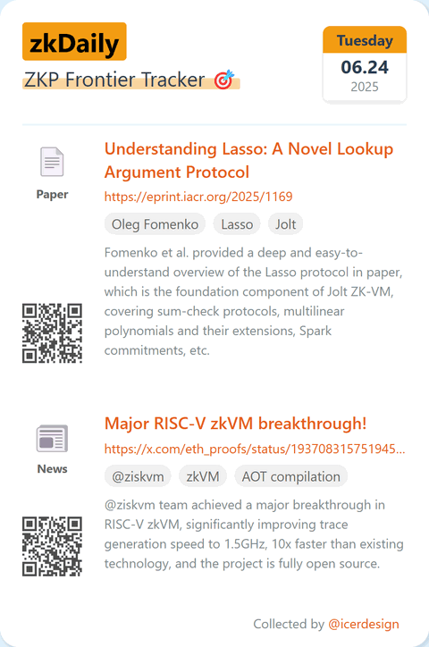
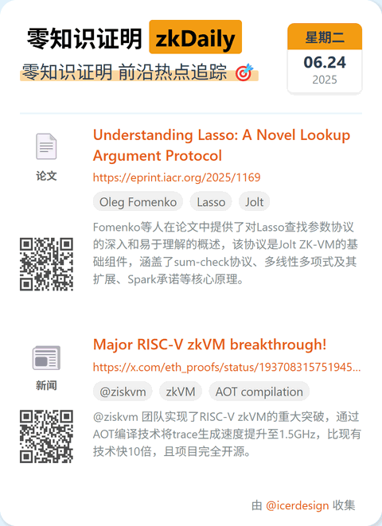
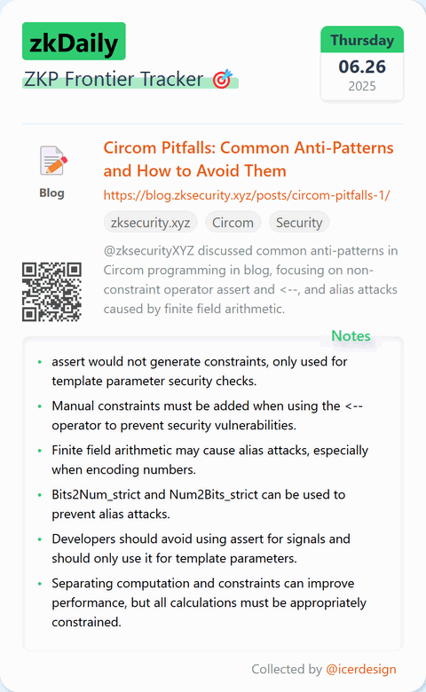
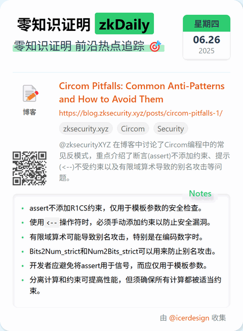
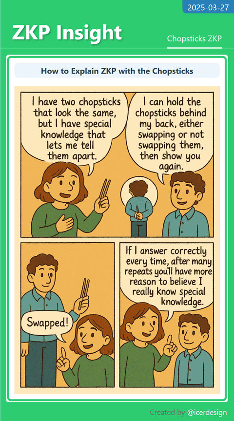
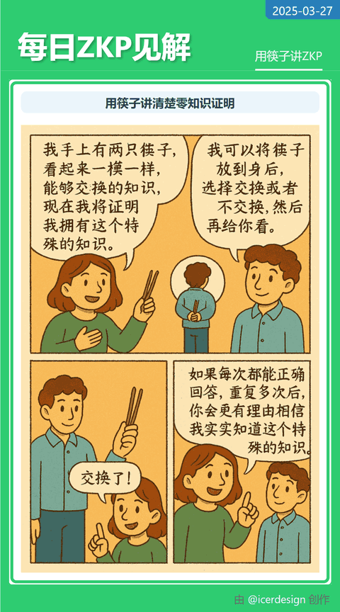

# ZKP News Cards 📰


Generate beautiful, shareable news cards for Zero Knowledge Proofs (ZKP) and blockchain technology. Updated **daily** with the latest news and insights. Easily forkable to create news cards for any topic of your choice!

<div align="center">
  
  
</div>

## ✨ Features

- 🔄 **Daily Updates**: Fresh ZKP and blockchain news every day
- 🌐 **Multilingual**: Support for English and Chinese
- 📱 **Instant Delivery**: Send cards directly to Telegram channels/groups
- 🤖 **WeCom Integration**: Share with your team on WeCom (WeChat Work)
- 📸 **Automated Screenshots**: Generate beautiful, shareable images
- 📄 **PDF Export**: Create PDF versions of your news cards
- 🔌 **API Access**: Access news data programmatically

## 📸 Examples

<details>
<summary>Click to see more examples</summary>
<div align="center">
  
  
</div>
<div align="center">
  
  
</div>
</details>

## 🚀 Quick Start

### Prerequisites

- Node.js
- Yarn package manager

### Installation

```bash
# Clone the repository
git clone https://github.com/wizicer/zk-news-cards.git
cd zk-news-cards

# Install dependencies
yarn install

# Copy environment file and configure
cp .env.example .env
# Edit .env with your Telegram bot token and chat IDs
```

### Usage

```bash
# Generate cards for today (both languages)
yarn generate:all

# Take screenshots of today's cards
yarn shot:all

# Send today's cards to configured Telegram channels
yarn cast:all

# Generate cards for a specific language
yarn generate && yarn screenshot -- -l en  # English
yarn generate && yarn screenshot -- -l zh  # Chinese
```

## 🔧 Environment Setup

### System Compatibility

This project works natively on most desktop environments (Windows, macOS, Linux). The dependencies below are only required if you're running on an Ubuntu server environment.

### Server Dependencies (Ubuntu only)

If running on an Ubuntu server, install Puppeteer dependencies:

```bash
sudo apt install ca-certificates fonts-liberation libasound2 libatk-bridge2.0-0 libatk1.0-0 libc6 libcairo2 libcups2 libdbus-1-3 libexpat1 libfontconfig1 libgbm1 libgcc1 libglib2.0-0 libgtk-3-0 libnspr4 libnss3 libpango-1.0-0 libpangocairo-1.0-0 libstdc++6 libx11-6 libx11-xcb1 libxcb1 libxcomposite1 libxcursor1 libxdamage1 libxext6 libxfixes3 libxi6 libxrandr2 libxrender1 libxss1 libxtst6 lsb-release wget xdg-utils
```

Required fonts for proper rendering:
```bash
sudo apt install fonts-noto-color-emoji fonts-wqy-zenhei fonts-lmodern
```

## 🛠️ Add a New Topic

Fork the repo and drop a new file in `src/data/` following the date pattern:

```js
// src/data/202507.js
export default [
  {
    date: "2025-07-01",
    projects: [
      {
        name: "My Awesome Article",
        url: "https://example.com",
        type: "博客",
        tags: ["Custom", {zh: "中文tag", en: "English tag"}],
        summary: {
          en: "English summary...",
          zh: "中文摘要..."
        },
        notes: {
          en: ["English notes..."],
          zh: ["中文注释..."]
        }
      }
    ]
  }
];
```

## 📚 Documentation

- [API Documentation](./API.md) - Details about the API structure and endpoints

## 🤝 Connect & Customize

- Connect your Telegram bot to receive daily updates
- Set up automated workflows with GitHub Actions
- Customize card templates to match your branding
- **Fork the repository** to create news cards for any topic you're interested in!

## 🤗 Contributing

Contributions, issues and feature requests are welcome!

## 📄 License

This project is licensed under the MIT License - see the LICENSE file for details
